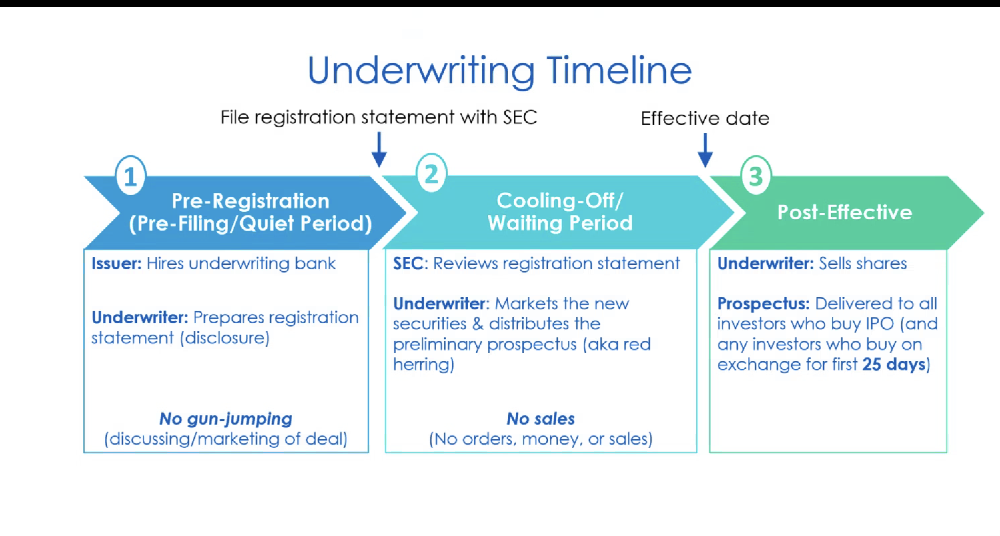
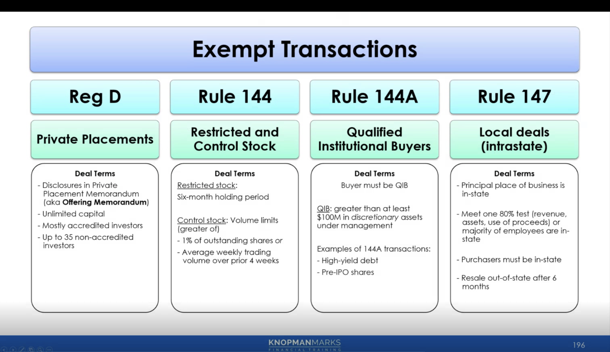

Sure, here is the information in Markdown format:

### Regulation A

**Definition**: Regulation A, often referred to as "Reg A," allows companies to raise capital through a simplified registration process. It is divided into two tiers based on the amount of money being raised.

**Tiers**:

1. **Tier 1**:

   - **Maximum Offering Amount**: Up to $20 million in a 12-month period.
   - **Investor Limitations**: No limitations on the number or type of investors.
   - **Disclosure Requirements**: Requires offering circular, which is less burdensome than a full registration statement.
   - **State Securities Laws**: Subject to state securities law (blue sky) requirements.

2. **Tier 2**:
   - **Maximum Offering Amount**: Up to $75 million in a 12-month period.
   - **Investor Limitations**: No limitations for accredited investors; non-accredited investors are limited to 10% of their annual income or net worth.
   - **Disclosure Requirements**: Requires more extensive disclosure, including audited financial statements and ongoing reporting requirements.
   - **State Securities Laws**: Exempt from state securities law requirements.

### Regulation D

**Definition**: Regulation D provides exemptions from registration for smaller public and private offerings. It includes several rules, with the most commonly used being Rule 504, Rule 506(b), and Rule 506(c).

**Rules**:

1. **Rule 504**:

   - **Maximum Offering Amount**: Up to $10 million in a 12-month period.
   - **Investor Limitations**: Generally, no restrictions on the number or type of investors.
   - **Disclosure Requirements**: Limited disclosure requirements; state securities laws apply.
   - **General Solicitation**: Generally not allowed unless offering meets specific conditions.

2. **Rule 506(b)**:

   - **Maximum Offering Amount**: Unlimited.
   - **Investor Limitations**: Up to 35 non-accredited investors and unlimited accredited investors.
   - **Disclosure Requirements**: Extensive disclosure if there are non-accredited investors.
   - **General Solicitation**: Not allowed.

3. **Rule 506(c)**:
   - **Maximum Offering Amount**: Unlimited.
   - **Investor Limitations**: All investors must be accredited.
   - **Disclosure Requirements**: No specific disclosure requirements, but issuers must take reasonable steps to verify accredited investor status.
   - **General Solicitation**: Allowed.

### Regulation S

**Definition**: Regulation S provides an exemption for offerings made outside the United States, allowing U.S. and foreign companies to raise capital from foreign investors without registering with the SEC.

**Key Points**:

- **Issuer Requirements**: Must comply with the laws of the country where the offering is made.
- **Investor Requirements**: Securities must be sold to non-U.S. persons.
- **Resale Restrictions**: Securities are subject to resale restrictions to prevent them from being immediately resold into the U.S. market.

### Rule 144A

**Definition**: Rule 144A provides a safe harbor exemption for the resale of securities to qualified institutional buyers (QIBs), allowing large institutional investors to trade restricted securities more easily.

**Key Points**:

- **Qualified Institutional Buyers (QIBs)**: Generally large institutions with at least $100 million in investable assets.
- **Issuer Requirements**: No issuer requirements, but securities must be sold initially to QIBs.
- **Resale Restrictions**: Allows QIBs to resell the securities among themselves without registering with the SEC.

### Comparison and Uses

1. **Regulation A**:

   - **Best For**: Companies seeking to raise moderate to substantial amounts of capital with some level of public disclosure.
   - **Advantages**: Easier compliance, potential for public investment, advertising allowed.
   - **Disadvantages**: More regulatory requirements compared to other exemptions, especially under Tier 2.

2. **Regulation D**:

   - **Best For**: Private companies seeking to raise capital with minimal regulatory burden.
   - **Advantages**: Flexible and less costly, no limit on offering size under Rule 506, general solicitation allowed under Rule 506(c).
   - **Disadvantages**: Restrictions on investor types and numbers, especially for non-accredited investors.

3. **Regulation S**:

   - **Best For**: Companies looking to raise capital from non-U.S. investors.
   - **Advantages**: Exemption from SEC registration, access to international capital markets.
   - **Disadvantages**: Compliance with foreign securities laws required, resale restrictions to prevent immediate U.S. market entry.

4. **Rule 144A**:
   - **Best For**: Large institutional investors and issuers looking for a liquid market for restricted securities.
   - **Advantages**: Simplifies resale of restricted securities, access to large institutional investors.
   - **Disadvantages**: Limited to QIBs, not suitable for retail investors.

Understanding these various regulations and offering methods helps companies choose the most suitable approach to raising capital while ensuring compliance with legal requirements. Investors also benefit by understanding the risks and opportunities associated with each type of offering.

Rule 144 allows public resale of restricted and control securities if a number of conditions are met. Restricted securities are those securities that have been acquired through a private placement or other exempt transaction (i.e. Regulation S for overseas offerings), and are not registered. Control securities are those held by an affiliate of the issuing company. An affiliate is a person, such as a director or large shareholder, in a relationship of control with the issuer. Control securities are not always subject to a holding period. They must satisfy a holding period only if they are also restricted. Securities acquired by non-affiliates through an open market transaction are neither restricted nor control stock, and are not subject to Rule 144.

The registration statement and prospectus contain the most important disclosures that are required of publicly offered securities under the '33 Act. Prior to the offering, the SEC will review the registration and preliminary prospectus for completeness, and it may request amendments or additions in these documents, before the offering can proceed. Recall, however, the SEC never actually approves or disapproves of the actual securities.

An offering memorandum is a disclosure document usually provided for exempt transactions, such as Regulation D or Regulation A offerings.

- **Agent Capacity**: 
  - Underwriters act in an agent capacity when the issuer bears the risk of the offering.
  - Any unsold issue is returned to the corporation.

- **Best Efforts Underwriting**:
  - Underwriters sell as much as possible.
  - Any unsold issue is returned to the issuing corporation.

- **Mini-Max Underwriting**:
  - A minimum amount must be sold, or the offering is called off.
  - If the minimum is sold, any unsold portion is returned to the issuer.

- **Firm Commitment Underwriting**:
  - Underwriters purchase the entire issue.

- **Standby Underwriting**:
  - A type of firm commitment offering to shareholders with preemptive rights.
  - Underwriters purchase the shares not subscribed to by current shareholders.

A free writing prospectus is used by an issuer to provide additional, updated information to investors beyond what the registration or prospects contains, with the goal being to provide investors with pertinent updates without having to amend their registration statement or prospectus.
